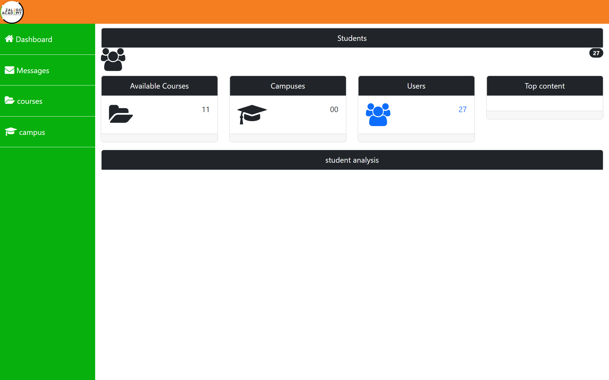
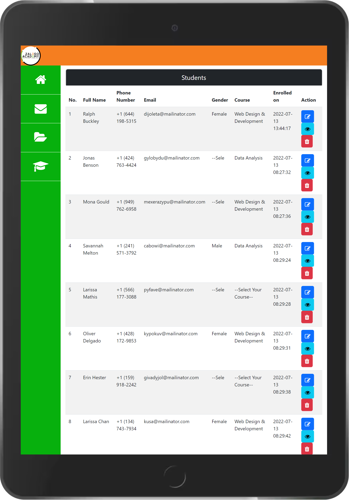
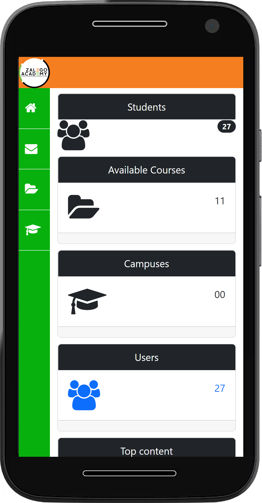

## Bootstrap Admin Dashboard
This project is the ultimate guide students build alongside instructor. It covers all technical key concepts including:
- HTML
- CSS3
- Bootstrap.
- MySQL
- PHP

As per the development of the project, Bootstrap Version 5.2  was used. Should their be any newest update. Instructor is advised to use the latest version.

### Screenshots
#### 1. Desktop screensize:

#### 2. Tablet Mode

#### 3. Smartphone

## How to Set Up the project

- Clone the repository
- Add the folder structure in your local server i.e XAMPP/WAMPP/LAMPP
- Access on the browser/
